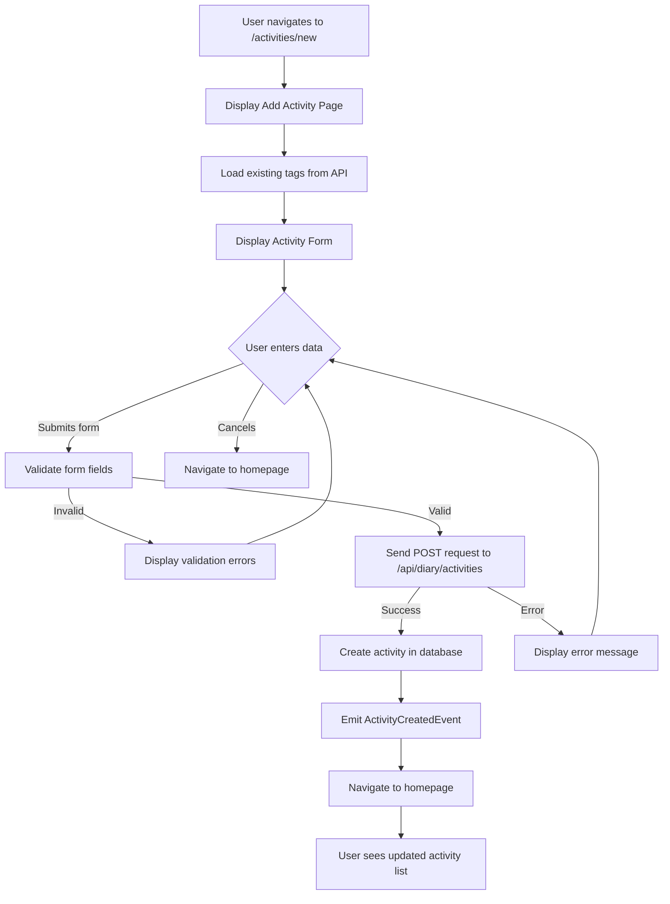

# Add Activity

## Introduction

The Add Activity feature allows users to create new financial activity records (transactions) with detailed information including content, time, associated tags, and optional income/outcome amounts.

**Dependencies:**

- Authentication system (user must be logged in)
- Activity database (MongoDB)
- Tag management system
- API endpoint for creating activities
- Tag query service

---

## User Stories

- As a user, I want to add a new activity with content, date/time, and tags so that I can record my financial transactions.
- As a user, I want the system to automatically detect income and outcome amounts from my activity description so that I can save time entering financial data.
- As a user, I want to select from existing tags or create new tags so that I can categorize my activities.
- As a user, I want to see validation errors if I miss required fields so that I understand what information is needed.
- As a user, I want to cancel adding an activity and return to the homepage so that I can abandon the action if needed.
- As a user, I want to be redirected to the homepage after successfully adding an activity so that I can see the updated activity list.

---

## Functionality

### Overview

The Add Activity feature consists of:

1. **Add Activity Page** - entry point with title and form container
2. **Activity Form** - form with content, tags, time, and financial fields
3. **Auto-calculation Engine** - intelligent extraction of income/outcome from description
4. **Tag Selection** - autocomplete tag selector with existing and new tag creation
5. **Date/Time Picker** - timestamp selection
6. **Form Validation** - client-side and server-side validation
7. **Submit Handler** - API call and navigation after success

### Detailed Behavior

**Form Fields:**

1. **Content** (Required)
   - Text area input for activity description
   - Multi-line support (supports newline characters)
   - Accepts any text
   - Autofocus enabled for better UX
   - Error display if field is empty or invalid

2. **Tags** (Required)
   - Autocomplete field fetching existing tags from API
   - Support for free solo mode (users can add custom tags)
   - Multiple tag selection
   - Tags are normalized: converted to lowercase and trimmed
   - Loading state while tags are being fetched
   - Error handling with refresh button on fetch failure

3. **Time** (Required)
   - DateTime picker component
   - Defaults to current date and time
   - Supports selection of any past or future date/time
   - ISO 8601 date string format
   - Error display for invalid dates

4. **Income** (Optional)
   - Number input field
   - Automatically populated based on content analysis
   - User can manually override the calculated value
   - Empty if no income detected or user removes it

5. **Outcome** (Optional)
   - Number input field
   - Automatically populated based on content analysis
   - User can manually override the calculated value
   - Empty if no expense detected or user removes it

**Auto-calculation Logic:**

Refer to [Income/Outcome Auto-Calculation Logic](./auto-calc-amounts.md).

**Form Validation:**

- Client-side:
  - Time: Required, must be a valid date
  - Content: Required, must be non-empty string
  - Tags: Required, must be array of strings
  - Income: Optional, must be a valid number string if provided
  - Outcome: Optional, must be a valid number string if provided
  - Schema: Yup object validation
- Server-side (API):
  - Content: Required, non-empty string
  - Time: Required, valid ISO date string
  - Tags: Required, array of strings (normalized to lowercase)
  - Income: Optional, valid number string
  - Outcome: Optional, valid number string

**Form Actions:**

- **Cancel Button:**
  - Navigates back to homepage (/)
  - Discards any form input
  - Secondary color variant

- **Submit Button:**
  - Triggers form validation
  - Shows loading state while submitting
  - Disabled when form is submitting

**Form Behavior:**

- Dynamic income/outcome recalculation:
  - Every time content field changes, auto-calculation runs
  - Auto-calculated values can be manually edited
  - Manual edits are preserved until content changes again
- Responsive layout:
  - Single column on mobile (xs)
  - Two columns for tags/time on tablet (sm)
  - Two columns for income/outcome on all screen sizes

### Edge Cases and Error Handling

**Validation Errors:**

- **Empty Content:** Display "This field is required" message below content field
- **Invalid Date:** Display error message below date/time field
- **API Error:** Trigger global error handler with user-friendly message
- **Tag Fetch Failure:** Display TagInput with refresh button to retry

**Processing Errors:**

- **Network Timeout:** Error handler displays appropriate message
- **Server Validation Failure:** Display validation error response from API
- **Invalid Activity Data:** Error handler handles and displays error to user

**Successful Submission:**

- Activity is created in database
- User is redirected to homepage
- Activity appears in the activity list

---

## Business Workflows

### Workflow: Add Activity

### Workflow: Content Analysis for Financial Detection

Refer to [Income/Outcome Auto-Calculation Logic](./auto-calc-amounts.md).

---

## Use Cases

### Use Case 1: Add Activity with Manual Income/Outcome

**Preconditions:**

- User is authenticated and logged in
- User is on the Add Activity page

**Trigger:**

- User wants to record an activity with manual income/outcome values

**Steps:**

1. User enters activity description in Content field (e.g., "Freelance project completed")
2. System auto-detects amounts if patterns match (optional)
3. User selects or creates tags from the Tags field
4. User confirms or modifies the date/time in Time picker
5. User manually enters Income amount (e.g., 1000)
6. User clears Outcome field if auto-calculated
7. User clicks Submit button
8. System validates all fields
9. System sends POST request to `/api/diary/activities`
10. System creates activity record in database
11. System emits ActivityCreatedEvent
12. System redirects user to homepage

**Postconditions:**

- Activity is created and visible in the activity list
- User is on the homepage
- Activity list is refreshed with the new activity

### Use Case 2: Add Activity with Auto-calculated Financial Data

**Preconditions:**

- User is authenticated and logged in
- User is on the Add Activity page

**Trigger:**

- User wants to record an activity and let the system auto-detect income/outcome

**Steps:**

1. User enters activity description with financial amounts (e.g., "Lunch meeting: nhận invoice 200k, chi cà phê 15k")
2. System auto-detects and calculates:
   - Income: 200 (from line with "nhận")
   - Outcome: 15 (from line without "nhận")
3. Income and Outcome fields are automatically populated
4. User selects tags
5. User confirms date/time (defaults to current)
6. User clicks Submit
7. System validates fields
8. System sends activity data to API
9. Activity is created

**Postconditions:**

- Activity with auto-calculated income/outcome is created
- User is redirected to homepage
- New activity appears in the list

### Use Case 3: Handle Form Validation Error

**Preconditions:**

- User is on the Add Activity page
- Form validation rules are in place

**Trigger:**

- User submits form with missing required fields

**Steps:**

1. User tries to submit form without entering content
2. System validates form
3. System detects missing Content field
4. System displays validation error "This field is required"
5. User views error message below content field
6. User enters valid content
7. User resubmits form
8. Validation passes
9. Form is submitted successfully

**Postconditions:**

- Form submission succeeds after correction
- User is redirected to homepage

### Use Case 4: Cancel Activity Entry

**Preconditions:**

- User is on the Add Activity page
- User has entered some data in the form

**Trigger:**

- User decides not to add the activity

**Steps:**

1. User clicks Cancel button
2. System navigates to homepage
3. Form data is discarded

**Postconditions:**

- User is on homepage
- No activity is created
- Activity list remains unchanged

---

## UI/UX Requirements

### Screen Layout

The Add Activity page includes:

1. **Header:**
   - Page title "Add Activity" using Title component
   - Consistent with MainLayout template

2. **Form Container:**
   - Grid-based layout using Material-UI Grid2
   - Responsive design (mobile-first)
   - Proper spacing between form sections

3. **Form Fields Layout:**
   - **Content Field:** Full width (xs: 12)
   - **Tags Field:** Full width (xs: 12), half width on tablet (sm: 6)
   - **Time Field:** Full width (xs: 12), half width on tablet (sm: 6)
   - **Income Field:** Half width (xs: 6)
   - **Outcome Field:** Half width (xs: 6)

4. **Action Buttons:**
   - Cancel button (secondary color, left-aligned)
   - Submit button (primary color, right-aligned)
   - Buttons use Actions component for layout
   - Submit button shows loading state during submission

### Interaction Details

- **Content Field Autofocus:**
  - Content field receives autofocus when page loads for faster input
  - User can immediately start typing

- **Dynamic Income/Outcome Update:**
  - Income and Outcome fields update in real-time as user types in Content field
  - User can manually override auto-calculated values
  - Auto-calculation reruns whenever content changes (replacing manual values)

- **Tag Selection:**
  - Click on Tags field opens autocomplete dropdown
  - Shows existing tags fetched from API
  - User can type to filter tags
  - FreeSolo mode allows creating new custom tags
  - Multiple tags can be selected

- **DateTime Selection:**
  - Click on Time field opens date/time picker
  - Defaults to current date and time
  - User can navigate to different dates and times
  - Selected value is displayed in the field

- **Form Submission:**
  - User clicks Submit button
  - Button shows loading state (disabled, loading indicator)
  - API request is sent
  - On success: Redirect to homepage with no confirmation
  - On error: Error message displayed, user remains on form

### Accessibility Standards

- **Screen Reader Support:**
  - Form labels are properly associated with inputs
  - Error messages are announced to screen readers
  - Button purposes are clear ("Add Activity", "Cancel", "Submit")

- **Keyboard Navigation:**
  - All form fields are keyboard accessible
  - Tab order: Content → Tags → Time → Income → Outcome → Cancel → Submit
  - Enter key submits form from any field
  - Escape key can cancel (optional, depends on component library)

- **Color Contrast:**
  - Material-UI default theme ensures WCAG AA compliance
  - Error messages use color + text (not color alone)
  - Labels are visible and readable

- **Error Message Display:**
  - Error messages appear below the field that caused the error
  - Error text color clearly differentiates from normal text
  - Required field indicators are visible

### Error Messages

- **Empty Content:** "This field is required"
- **Invalid Date:** "This field is required" (if date is missing)
- **Missing Tags:** Validation error if tags array is empty
- **API Error (Network):** "Unable to save activity. Please check your connection and try again."
- **API Error (Validation):** Display server validation error response
- **API Error (Server):** "An error occurred while saving the activity. Please try again."
- **Tag Fetch Failure:** Display TagInput with loading state and refresh button

---

## Acceptance Criteria

1. **Form Validation:**
   - Content field is required and displays error if empty ✓
   - Tags field is required ✓
   - Time field defaults to current date/time ✓
   - Income and Outcome fields are optional ✓
   - All validation messages are displayed inline ✓

2. **Auto-calculation:**
   - Income/Outcome values are automatically calculated from content ✓
   - Calculation runs when content changes ✓
   - User can manually override calculated values ✓
   - Auto-calculated values use pattern matching for amounts ✓

3. **Tag Management:**
   - Existing tags are loaded from API ✓
   - User can select multiple tags ✓
   - User can create new tags (free solo mode) ✓
   - Tags are normalized to lowercase on submission ✓
   - Tag loading errors show refresh button ✓

4. **Form Submission:**
   - Form data is sent to POST /api/diary/activities ✓
   - Submit button shows loading state during submission ✓
   - User is redirected to homepage on success ✓
   - Error messages are displayed on failure ✓
   - User can retry submission after error ✓

5. **Navigation:**
   - Cancel button navigates to homepage without saving ✓
   - Submit button redirects to homepage after successful save ✓
   - Page title "Add Activity" is displayed ✓

6. **Responsive Design:**
   - Form layout is responsive on mobile (xs) ✓
   - Form layout adapts to tablet (sm) and larger screens ✓
   - All form fields are usable on all screen sizes ✓

7. **Accessibility:**
   - Content field has autofocus ✓
   - All form fields are keyboard navigable ✓
   - Error messages are readable by screen readers ✓
   - Color contrast meets WCAG AA standards ✓

8. **API Integration:**
   - Request payload matches ActivityDto schema ✓
   - Authentication token is included in request ✓
   - Response is properly handled and activity is created ✓
   - Error responses are handled gracefully ✓
