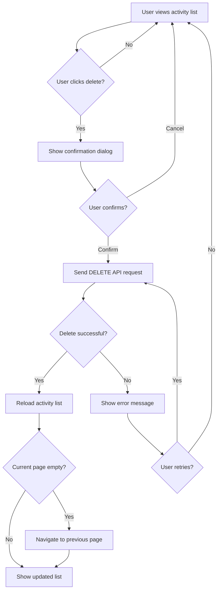

# Delete Activity

## Introduction

**Description:**
The Delete Activity feature allows users to permanently remove financial activity records (transactions) from the activity list.

**Business Value:**

- Allows users to remove duplicate or erroneous transaction entries
- Provides data cleanup and account management capabilities
- Maintains accurate financial records

**Dependencies:**

- Authentication system (user must be logged in)
- Activity database (MongoDB)
- Activity list view (activity data display)
- API endpoint for deleting activities

---

## User Stories

- As a user, I want to be prompted with a confirmation before deleting so that I don't accidentally remove important transactions.
- As a user, I want to delete an activity directly from the activity list so that I can manage my activities without extra steps.

---

## Functionality

### Overview

The Delete Activity feature consists of:

1. **Delete Action Trigger** - delete button in activity item context menu
2. **Confirmation Dialog** - modal asking for deletion confirmation with activity details
3. **Delete Handler** - API call to remove activity from database
4. **List Reload** - refresh activity list after successful deletion

### Delete Action Trigger

**Location:**

- Activity item context menu (three-dot menu)

**Button Properties:**

- Label: Delete or trash icon
- Color: Red or warning color
- Accessibility: Proper ARIA labels and keyboard navigation

### Confirmation Dialog

**Dialog Content:**

- **Title:** "Delete Activity?"
- **Message:** Display activity datetime for verification
- **Warning:** "This action cannot be undone."
- **Action Buttons:**
  - Primary: "Delete" button (red/danger color)
  - Secondary: "Cancel" button (neutral color)

**Dialog Behavior:**

- Closes on Cancel button click (no changes made)
- Closes on Escape key press (no changes made)
- Closes on background click (no changes made)
- Loading state on Delete button during API call
- Error message display if deletion fails

### Delete Handler

**API Endpoint:**

- **Method:** DELETE
- **Route:** `/api/diary/activities/{id}`
- **Parameters:** `id` - The ID of the activity to delete
- **Authentication:** Required (user token in header)
- **Expected Response:**
  - **Success (200/204):** Confirmation of deletion
  - **Error (400, 403, 404, 500):** Error message

**Error Cases:**

- **404 Not Found:** Activity does not exist or belongs to different user
- **403 Forbidden:** User doesn't have permission to delete this activity
- **400 Bad Request:** Invalid activity ID format
- **500 Internal Server Error:** Database or server error

### List Reload

**After Successful Deletion:**

1. Close confirmation dialog
2. Reload activity list from API
3. If current page is now empty, navigate to previous page
4. Display updated activity list

---

## Business Workflows

### Workflow: Delete Activity from List

---

## Use Cases

### Use Case 1: Delete Activity from List

**Preconditions:**

- User is logged in
- User is viewing the activity list

**Trigger:**

- User clicks delete action on an activity item

**Steps:**

1. User identifies activity to delete in the list
2. User clicks delete button in activity context menu
3. System displays confirmation dialog with message
4. User clicks "Delete" button in dialog
5. System sends DELETE request to API with activity ID
6. System receives successful response from API
7. System closes confirmation dialog
8. System reloads activity list from API
9. System displays updated activity list

**Postconditions:**

- Activity is removed from database
- Activity list is refreshed and updated
- User remains on activity list page (or previous page if current was emptied)

### Use Case 2: Cancel Activity Deletion

**Preconditions:**

- User is logged in
- Confirmation dialog is displayed for deletion

**Trigger:**

- User clicks "Cancel" button or presses Escape key

**Steps:**

1. User initiates delete action
2. System displays confirmation dialog
3. User clicks "Cancel" button or presses Escape
4. System closes confirmation dialog
5. Activity remains unchanged in database

**Postconditions:**

- Confirmation dialog is closed
- No API request is sent
- Activity is unchanged
- User is on activity list view

### Use Case 3: Handle Deletion Error

**Preconditions:**

- User is logged in
- User has initiated deletion
- API request fails

**Trigger:**

- API returns error response

**Steps:**

1. User confirms deletion in dialog
2. System sends DELETE request to API
3. API returns error response
4. System displays error message to user
5. User clicks "Try Again" button
6. System retries DELETE request

**Postconditions:**

- User is informed of error or successful deletion
- Activity is either deleted or remains unchanged based on API response

---

## Acceptance Criteria

- [ ] Delete button is visible in activity list item context menu
- [ ] Confirmation dialog displays activity details accurately
- [ ] API endpoint successfully deletes activity from database
- [ ] Activity list reloads after successful deletion
- [ ] Deleted activity is no longer visible in list
- [ ] Cancelling deletion does not modify the activity
- [ ] Error messages are clear if deletion fails
- [ ] Delete action requires authentication
- [ ] Dialog closes when user clicks Cancel button
- [ ] Dialog closes when user clicks outside the dialog area
- [ ] Dialog closes when user presses Escape key
- [ ] Loading state displays on Delete button during API call
- [ ] Invalid activity ID returns proper error message
- [ ] Network errors are handled gracefully
- [ ] If current page becomes empty after deletion, navigate to previous page
