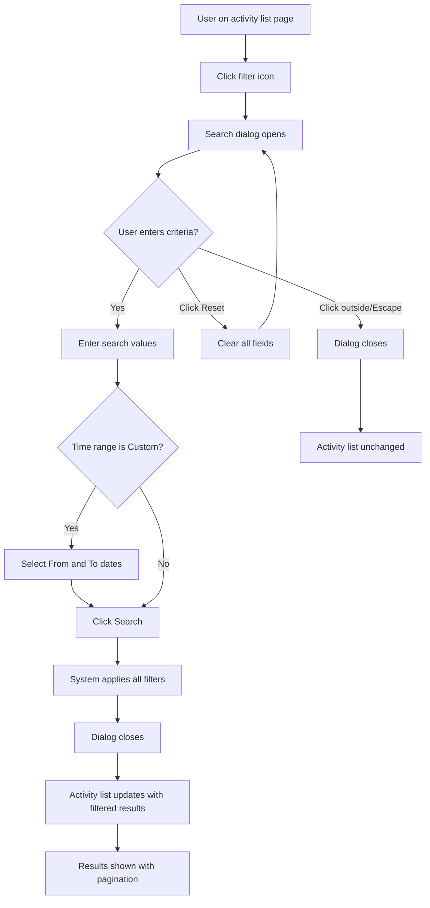
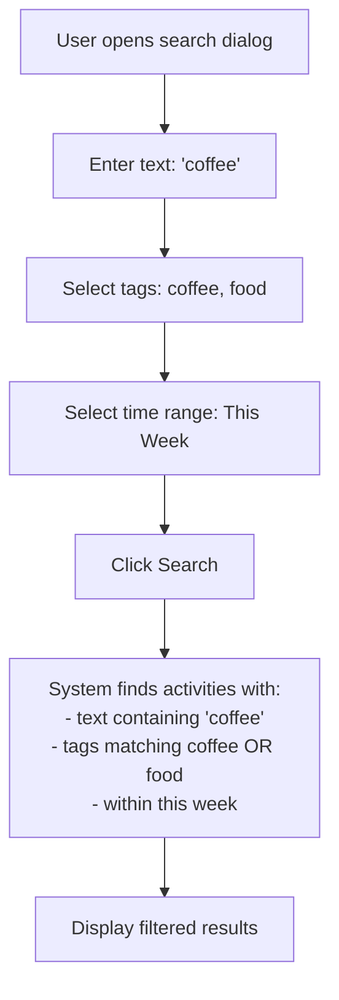

# Search Activity List

## Introduction

**Description:**
The Search Activity List feature allows users to filter and find specific activities by text content, tags, and time range. Users can access the search dialog through a filter icon and apply multiple search criteria simultaneously to narrow down the activity list displayed on the homepage.

**Business Value:**
Enables users to quickly locate specific financial transactions without manually browsing through all activities. This improves user experience and helps users manage large volumes of transaction history efficiently.

**Dependencies:**

- Authentication system (user must be logged in)
- View Activity List feature (displays search results)
- Activity data with full-text search indexing
- API endpoint to retrieve filtered activities

---

## User Stories

- As a user, I want to search activities by text so that I can find transactions by content.
- As a user, I want to filter activities by tags so that I can view only transactions related to specific categories.
- As a user, I want to filter activities by date range so that I can view transactions within a specific time period.
- As a user, I want to use preset time ranges (This Week, This Month, This Year, Last Month) so that I can quickly search common date periods without entering custom dates.
- As a user, I want to use custom date ranges so that I can search transactions within any specific date range I choose.
- As a user, I want to combine multiple search criteria so that I can perform complex searches using text, tags, and date filters simultaneously.
- As a user, I want to reset search filters so that I can clear all criteria and start a new search.
- As a user, I want to see updated activity results immediately after applying search filters so that I can see the filtered results without page reload.

---

## Functionality

### Overview

The feature provides a search dialog that allows users to filter activities using multiple criteria:

1. **Search Dialog** - modal interface for entering search criteria
2. **Text Search** - full-text search on activity content
3. **Tag Filtering** - filter by one or multiple tags
4. **Time Range Filtering** - filter by preset or custom date ranges

### Detailed Behavior

**Search Dialog Interface:**

- Accessible via a filter icon button in the toolbar on the activity list page
- Modal dialog with title "Search activities"
- Contains the following fields:
  - **Text** - text input field for activity content search (optional, empty by default)
  - **Tags** - multi-select dropdown for selecting tags (optional, empty by default)
  - **Time Range** - dropdown with predefined options (defaults to "This Month")
  - **From/To Dates** - date picker fields (conditionally displayed when "Custom" time range is selected)
- Dialog actions:
  - **Reset** - clears all fields to their default values
  - **Search** - applies filters and closes the dialog

**Text Search:**

- Full-text search on activity content field
- Case-insensitive search
- Searches anywhere in the activity content
- Optional filter (empty text means no text filtering)

**Tag Filtering:**

- Multi-select field allowing users to select one or more tags
- Tags are loaded from the available tags in the system
- Optional filter (empty selection means no tag filtering)
- Activities matching any of the selected tags are included in results

**Time Range Filtering:**

- Dropdown with the following preset options:
  - **All** - no date filtering, shows all activities
  - **This Week** - activities from Monday to Sunday of current week
  - **This Month** - activities from first to last day of current month
  - **This Year** - activities from January 1 to December 31 of current year
  - **Last Month** - activities from first to last day of previous month
  - **Custom** - allows users to specify custom date range
- When **Custom** is selected:
  - Two date picker fields appear: "From" and "To"
  - "From" date must be at start of day (00:00:00)
  - "To" date must be at end of day (23:59:59)
- Time range filters are exclusive and cannot be combined
- Default time range is "This Month"

**Search Execution and Results:**

- Clicking "Search" applies all filters and updates the activity list
- Resets pagination to page 1
- Empty search criteria (all fields at defaults) displays all activities
- Results are displayed in the Activity List with date grouping and pagination

**Reset Functionality:**

- Resets all fields to default values:
  - Text: empty string
  - Tags: empty array
  - Time Range: "This Month"
  - Custom dates: cleared
- Does NOT execute a search; user must click Search after reset

**Dialog Behavior:**

- Dialog closes after successful search
- Dialog remains open if user clicks Reset
- Dialog can be closed by clicking outside dialog area or pressing Escape key
- Dialog maintains entered values while open (until Reset is clicked)

### Edge Cases and Error Handling

- **Invalid custom date range:** When "Custom" is selected, both From and To dates must be provided. Search cannot proceed without complete date range.
- **No results:** If search criteria returns no activities, the Activity List displays the empty state message "There's no items to display."
- **Special characters in text search:** MongoDB text search handles special characters; partial matches are supported.
- **Multiple tag selection:** If multiple tags are selected, activities containing ANY of the selected tags are included (OR logic).

---

## Business Workflows

### Workflow: Search Activities

### Workflow: Apply Multiple Filter Criteria

---

## Use Cases

### Use Case 1: Basic Text Search

**Preconditions:**

- User is logged in
- User is in the homepage
- Activities exist in the system

**Trigger:**

- User clicks the filter icon

**Steps:**

1. Search dialog opens with default values
2. User enters text in the "Text" field (e.g., "coffee")
3. User clicks "Search"
4. System executes text search on activity content
5. Dialog closes
6. Activity list updates with matching activities

**Postconditions:**

- Activity list displays activities containing the searched text
- Activities are paginated with 10 items per page
- Pagination controls show updated page count

---

### Use Case 2: Filter by Tags

**Preconditions:**

- User is logged in
- User is in the homepage
- Activities with tags exist in the system

**Trigger:**

- User clicks the filter icon

**Steps:**

1. Search dialog opens
2. User clicks on the "Tags" dropdown
3. User selects one or more tags (e.g., "food", "restaurant")
4. User clicks "Search"
5. System filters activities with any of the selected tags
6. Dialog closes
7. Activity list updates with activities matching the tags

**Postconditions:**

- Activity list displays only activities with at least one of the selected tags
- Results are displayed with pagination

---

### Use Case 3: Filter by Preset Time Range

**Preconditions:**

- User is logged in
- User is in the homepage

**Trigger:**

- User clicks the filter icon

**Steps:**

1. Search dialog opens with "This Month" selected by default
2. User clicks on "Time Range" dropdown
3. User selects a preset option (e.g., "This Week")
4. User clicks "Search"
5. System filters activities within the selected time period
6. Dialog closes
7. Activity list updates with activities from the selected period

**Postconditions:**

- Activity list displays only activities within the selected time range
- Default option is "This Month"

---

### Use Case 4: Filter by Custom Date Range

**Preconditions:**

- User is logged in
- User is in the homepage

**Trigger:**

- User clicks the filter icon

**Steps:**

1. Search dialog opens
2. User clicks on "Time Range" dropdown
3. User selects "Custom"
4. "From" and "To" date picker fields appear
5. User selects "From" date (e.g., April 1, 2026)
6. User selects "To" date (e.g., April 30, 2026)
7. User clicks "Search"
8. System filters activities within the custom date range
9. Dialog closes
10. Activity list updates with activities from the custom period

**Postconditions:**

- Activity list displays only activities within the specified custom date range
- "From" date is at start of day (00:00:00)
- "To" date is at end of day (23:59:59)

---

### Use Case 5: Combined Multi-Criteria Search

**Preconditions:**

- User is logged in
- User is in the homepage
- Activities with various criteria exist in the system

**Trigger:**

- User clicks the filter icon

**Steps:**

1. Search dialog opens
2. User enters text: "restaurant"
3. User selects tags: "food" and "dining"
4. User selects time range: "This Month"
5. User clicks "Search"
6. System executes combined search:
   - Text matching "restaurant"
   - AND (tags matching "food" OR "dining")
   - AND (time within this month)
7. Dialog closes
8. Activity list updates with activities matching all criteria

**Postconditions:**

- Activity list displays only activities matching all search criteria
- Results are paginated

---

### Use Case 6: Reset Search Filters

**Preconditions:**

- User is logged in
- User has opened the search dialog
- User has entered search criteria

**Trigger:**

- User clicks "Reset" button in the search dialog

**Steps:**

1. User clicks "Reset"
2. All fields revert to default values:
   - Text: empty
   - Tags: empty
   - Time Range: "This Month"
   - Custom dates: hidden
3. Dialog remains open
4. User can enter new search criteria or click outside to close

**Postconditions:**

- All search criteria are cleared
- Dialog is still open (user can enter new criteria or close)
- Activity list remains showing previously filtered results

---

## UI/UX Requirements

**Search Dialog Layout:**

- Dialog title: "Search activities"
- Form layout using responsive grid (12 columns):
  - **Text field** (full width on mobile, full width on desktop)
    - Label: "Text"
    - Placeholder: (optional)
    - Auto-focus when dialog opens
    - Single line input
  - **Tags field** (full width on mobile, 6 columns on desktop)
    - Label: "Tags"
    - Multi-select dropdown
    - Displays selected tags
    - Search/filter available tags while typing
  - **Time Range field** (full width on mobile, 6 columns on desktop)
    - Label: "Time range"
    - Dropdown with predefined options
    - Default value: "This Month"
  - **Date Range fields** (conditionally displayed when Custom is selected)
    - "From" date picker (full width on mobile, 6 columns on desktop)
    - "To" date picker (full width on mobile, 6 columns on desktop)
    - Only visible when Time Range is set to "Custom"

**Dialog Actions:**

- **Reset button** (secondary style, small size)
  - Label: "Reset"
  - Color: secondary
  - Position: left side of action area
- **Search button** (primary style, small size)
  - Label: "Search"
  - Type: submit
  - Color: primary
  - Position: right side of action area

**Search Dialog Trigger:**

- **Filter icon button** in the activity list toolbar
- Icon: Filter/funnel icon
- Size: small
- Color: default (neutral)
- Located in the toolbar near the "Add Activity" button

**Consistency Rules:**

- Follow Material-UI design system components
- Consistent spacing and padding with the activity list page
- Consistent typography (labels, input text)
- Consistent color usage (primary, secondary)
- Responsive design: works on mobile (375px) and desktop viewports

**Error Handling and User Feedback:**

- If custom date range is incomplete: show validation message or prevent search
- If search yields no results: Activity List shows empty state message
- Dialog provides visual feedback when fields are filled
- Submit button is always enabled (validation happens on backend)

---

## Acceptance Criteria

1. ✅ Filter icon appears in the activity list toolbar
2. ✅ Clicking filter icon opens search dialog with title "Search activities"
3. ✅ Search dialog contains Text, Tags, and Time Range fields
4. ✅ Text field is auto-focused when dialog opens
5. ✅ Time Range defaults to "This Month"
6. ✅ From/To date pickers appear when Time Range is set to "Custom"
7. ✅ User can enter text and search by activity content
8. ✅ User can select one or multiple tags
9. ✅ User can select preset time ranges: All, This Week, This Month, This Year, Last Month
10. ✅ User can select custom date range
11. ✅ Clicking "Search" applies all filters and closes dialog
12. ✅ Activity list updates with filtered results after search
13. ✅ Pagination resets to page 1 after search
14. ✅ Results are displayed with date grouping and pagination
15. ✅ Clicking "Reset" clears all fields to defaults (dialog remains open)
16. ✅ Multiple search criteria are combined (AND logic)
17. ✅ Multiple tags are combined with OR logic (activities with any selected tag)
18. ✅ Empty search shows all activities
19. ✅ No results displays "There's no items to display." message
20. ✅ Dialog closes when clicking outside or pressing Escape
21. ✅ Search is responsive on mobile and desktop viewports

---

## Out of Scope

- Search history or saved searches
- Search suggestions or autocomplete
- Advanced search syntax
- Search results sorting options (always sorted by time descending)
- Search results export or download
- Real-time search as user types (search only on form submission)
- Full-text search on tags (only exact tag matching)
- Nested/hierarchical tag filtering
- Search analytics or usage tracking
