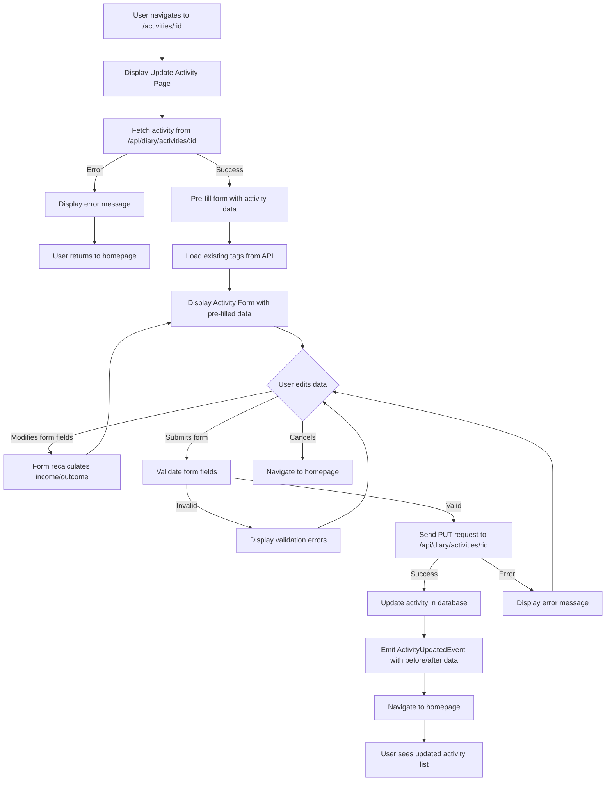

# Update Activity

## Introduction

The Update Activity feature allows users to edit existing financial activity records (transactions) with the ability to modify content, time, associated tags, and income/outcome amounts.

**Business Value:**

- Allows users to correct mistakes in activity records
- Enables updates to transaction details as new information becomes available
- Maintains data accuracy and reliability of the activity history
- Provides flexibility to reorganize or reclassify activities

**Dependencies:**

- Authentication system (user must be logged in)
- Activity database (MongoDB)
- API endpoint for fetching and updating activities

---

## User Stories

- As a user, I want to edit an activity's content, date/time, and tags so that I can correct mistakes or update information.
- As a user, I want the system to automatically recalculate income and outcome amounts when I edit the content so that the financial data stays accurate.
- As a user, I want to see the existing activity data pre-filled in the form so that I don't have to re-enter everything.
- As a user, I want validation errors displayed if I enter invalid data so that I understand what needs to be fixed.
- As a user, I want to cancel editing and return to the homepage so that I can discard changes.
- As a user, I want to be redirected to the homepage after successfully updating an activity so that I can verify the updated data in the activity list.

---

## Functionality

### Overview

The Update Activity feature consists of:

1. **Update Activity Page** - entry point with title and form container
2. **Activity Loading** - fetches existing activity data from API
3. **Activity Form** - pre-filled form with content, tags, time, and financial fields (reuses Add Activity form)
4. **Auto-calculation Engine** - intelligent recalculation of income/outcome from updated description
5. **Tag Selection** - autocomplete tag selector with existing and new tag creation
6. **Date/Time Picker** - timestamp selection
7. **Form Validation** - client-side and server-side validation
8. **Submit Handler** - API call and navigation after success

### Page Access

- **Route:** `/activities/:id`
- **Parameters:**
  - `:id` - The id of the activity to edit
- **Access:** Protected route - requires authentication
- **Navigation:** Accessible from activity menu or activity detail view

### Detailed Behavior

**Page Load:**

1. Component extracts activity ID from URL parameters
2. Fetches activity data using `GET /api/diary/activities/{id}`
3. If activity not found, displays error to user
4. Pre-fills form with existing activity data
5. Displays page title "Update Activity"

**Form Fields (Pre-filled with existing values):**

1. **Content** (Required)
   - Text area input for activity description
   - Multi-line support (supports newline characters)
   - Pre-filled with existing activity content
   - Autofocus enabled for better UX
   - Error display if field is empty or invalid

2. **Tags** (Required)
   - Autocomplete field fetching existing tags from API
   - Support for free solo mode (users can add custom tags)
   - Multiple tag selection
   - Pre-filled with existing tags
   - Tags are normalized: converted to lowercase and trimmed
   - Loading state while tags are being fetched
   - Error handling with refresh button on fetch failure

3. **Time** (Required)
   - DateTime picker component
   - Pre-filled with existing activity time
   - Supports selection of any past or future date/time
   - ISO 8601 date string format
   - Error display for invalid dates

4. **Income** (Optional)
   - Number input field
   - Pre-filled with existing income amount (if any)
   - Automatically updated based on content changes via auto-calculation
   - User can manually override the calculated value
   - Empty if no income detected or user removes it

5. **Outcome** (Optional)
   - Number input field
   - Pre-filled with existing outcome amount (if any)
   - Automatically updated based on content changes via auto-calculation
   - User can manually override the calculated value
   - Empty if no expense detected or user removes it

**Auto-calculation Logic:**

Refer to [Income/Outcome Auto-Calculation Logic](./auto-calc-amounts.md).

**Form Validation:**

- Client-side:
  - Time: Required, must be a valid date
  - Content: Required, must be non-empty string
  - Tags: Required, must be array of strings
  - Income: Optional, must be a valid number string if provided
  - Outcome: Optional, must be a valid number string if provided
  - Schema: Yup object validation
- Server-side (API):
  - Content: Required, non-empty string
  - Time: Required, valid ISO date string
  - Tags: Required, array of strings (normalized to lowercase)
  - Income: Optional, valid number string
  - Outcome: Optional, valid number string

**Form Actions:**

- **Cancel Button:**
  - Navigates back to homepage (/)
  - Discards any unsaved changes
  - Secondary color variant

- **Submit Button:**
  - Triggers form validation
  - Shows loading state while submitting
  - Disabled when form is submitting

**Form Behavior:**

- Dynamic income/outcome recalculation:
  - Every time content field changes, auto-calculation runs
  - Auto-calculated values can be manually edited
  - Manual edits are preserved until content changes again
- Responsive layout:
  - Single column on mobile (xs)
  - Two columns for tags/time on tablet (sm)
  - Two columns for income/outcome on all screen sizes

### Edge Cases and Error Handling

**Validation Errors:**

- **Empty Content:** Display "This field is required" message below content field
- **Invalid Date:** Display error message below date/time field
- **API Error:** Trigger global error handler with user-friendly message
- **Tag Fetch Failure:** Display TagInput with refresh button to retry

**Loading States:**

- **Activity Data Loading:** Show loading indicator while fetching activity from API
- **Form Submission:** Disable submit button and show loading state while submitting

**Processing Errors:**

- **Activity Not Found:** Display error message if activity ID is invalid or activity was deleted
- **Network Timeout:** Error handler displays appropriate message
- **Server Validation Failure:** Display validation error response from API

**Successful Submission:**

- Activity is updated in database
- Activity-related tags may be updated or created if new tags were added
- ActivityUpdatedEvent is emitted with before/after activity data
- User is redirected to homepage
- Updated activity appears in the activity list with new data

---

## Business Workflows

### Workflow: Update Activity

### Workflow: Content Analysis for Financial Detection (on edit)

Refer to [Income/Outcome Auto-Calculation Logic](./auto-calc-amounts.md).

---

## Use Cases

### Use Case 1: View Activity for Editing

**Preconditions:**

- User is authenticated
- Activity exists in the database
- User has navigated to the update activity page

**Trigger:**

- User clicks "Edit" on an activity in the activity list
- OR user directly navigates to `/activities/{id}`

**Steps:**

1. System fetches activity data from the database
2. System displays the Update Activity page with page title
3. System pre-fills all form fields with existing activity data
4. System loads available tags from the tag query service
5. System displays the activity form with pre-filled values

**Postconditions:**

- Update Activity page is displayed
- All form fields are pre-populated with current activity data
- Tags are loaded and available for selection
- User is ready to edit the activity

**Exception Paths:**

- If activity ID is invalid or missing, display error message
- If activity is not found in database, display error message
- If tag fetching fails, display error with retry option

### Use Case 2: Edit Activity Fields

**Preconditions:**

- User is on the Update Activity page
- Activity form is displayed with pre-filled data

**Trigger:**

- User modifies one or more form fields

**Steps:**

1. User changes content in the content field
2. System recalculates income/outcome based on new content
3. System updates income/outcome fields with calculated values
4. User modifies additional fields (tags, time, income, outcome)
5. User manually edits income/outcome if needed

**Postconditions:**

- Form reflects all user changes
- Income/outcome values are auto-calculated whenever content changes
- Manual edits to income/outcome are preserved until content changes again

### Use Case 3: Submit Updated Activity

**Preconditions:**

- User is on the Update Activity page
- User has made changes to one or more fields
- Form is valid or ready for validation

**Trigger:**

- User clicks the "Submit" or "Update" button

**Steps:**

1. System validates all form fields against validation schema
2. If validation fails, system displays inline error messages for invalid fields
3. If validation succeeds, system sends PUT request to `/api/diary/activities/{id}`
4. System sends all form data: content, tags, time, income, outcome
5. Server validates the data again
6. Server checks if activity exists
7. Server updates the activity in the database
8. Server emits ActivityUpdatedEvent with before and after activity data
9. Server returns updated activity to client
10. System navigates user to homepage (/)
11. Activity list is refreshed to show updated activity

**Postconditions:**

- Activity is updated in the database with new values
- User is redirected to homepage
- Activity appears in the list with updated data
- Other users' views are updated via event system if applicable

**Exception Paths:**

- If validation fails: Display error messages inline for each invalid field
- If network error occurs: Display error message and keep form intact for retry
- If activity not found: Display error message (activity may have been deleted)
- If server validation fails: Display validation error response from API

### Use Case 4: Cancel Editing Activity

**Preconditions:**

- User is on the Update Activity page
- User may or may not have made changes to the form

**Trigger:**

- User clicks the "Cancel" button
- OR user navigates away from the page

**Steps:**

1. System navigates user back to homepage (/)
2. Any unsaved changes are discarded
3. Activity list is displayed

**Postconditions:**

- User returns to homepage
- No changes are saved
- Activity remains unchanged in the database

---

## UI/UX Requirements

**Page Layout:**

- Page title: "Update Activity" displayed at the top
- Form layout matches Add Activity form for consistency
- Form uses responsive grid layout (single column on mobile, two columns on larger screens)
- Cancel and Submit buttons positioned at the bottom of the form

**Interaction Details:**

- **Form Field Interactions:**
  - Content field has autofocus enabled for immediate editing
  - Income/outcome fields are automatically updated when content changes
  - Users can manually edit income/outcome, and these values persist until content changes again
  - Tags field provides autocomplete suggestions from existing tags
  - Time field provides a datetime picker for easy date/time selection

- **Button States:**
  - Submit button is disabled while form is submitting
  - Submit button shows loading indicator during submission
  - Cancel button navigates away immediately without confirmation
  - Both buttons have hover and active states

- **Error Display:**
  - Validation errors displayed inline below respective form fields
  - Error text shown in red color matching error severity
  - API errors displayed as toast or alert message
  - Activity not found error displays full-page error message

- **Loading States:**
  - Loading spinner displayed while fetching activity data
  - "Loading..." or skeleton placeholders for form fields during initial load
  - Submit button disabled with loading indicator during submission

**Accessibility Standards:**

- Form fields have associated labels for screen reader compatibility
- Error messages linked to form fields via `aria-describedby`
- Proper color contrast for error messages and buttons
- Full keyboard navigation support for all form fields and buttons
- Form can be submitted with Enter key or by clicking Submit button
- Tab order follows logical flow: content → tags → time → income → outcome → cancel/submit buttons

**Consistency Rules:**

- Form components match Add Activity feature for UI consistency
- Styling and spacing aligned with project design system
- Button colors and styles consistent with other pages
- Error message formatting matches error handling patterns used elsewhere

**Error Handling Messages:**

- "This field is required" - for required fields left empty
- "Invalid date" - when date picker has invalid value
- "Activity not found" - when activity ID is invalid or activity was deleted
- "Failed to update activity" - generic error when update fails
- "Failed to fetch tags" - when tag loading fails
- "Network error" - when request times out or connectivity fails

---

## Technical Requirements

**APIs and Integrations:**

- **Fetch Activity:** `GET /api/diary/activities/{id}`
  - Parameters: Activity ID (MongoDB ObjectId)
  - Response: Activity object with all fields including content, tags, time, income, outcome
  - Error responses: 404 Not Found, 400 Bad Request

- **Update Activity:** `PUT /api/diary/activities/{id}`
  - Parameters: Activity ID (MongoDB ObjectId)
  - Request body: ActivityDto object with content, tags, time, income, outcome
  - Response: Updated Activity object
  - Error responses: 404 Not Found, 400 Bad Request (validation errors)

- **Fetch Tags:** Uses existing tag query service (same as Add Activity)
  - Returns list of available tags for autocomplete

**Data Models and Storage:**

- **Activity Model:**
  - `_id`: MongoDB ObjectId (primary key)
  - `content`: string (required, max length to be determined)
  - `tags`: array of strings (required, normalized to lowercase)
  - `time`: ISO 8601 date string (required)
  - `income`: number (optional)
  - `outcome`: number (optional)
  - `userId`: MongoDB ObjectId (reference to user)
  - `createdAt`: ISO 8601 timestamp
  - `updatedAt`: ISO 8601 timestamp

- **Storage:** MongoDB collection named "activities"

**Performance Expectations:**

- Activity fetch: < 500ms (from database)
- Tag fetch: < 500ms (from database)
- Activity update: < 1000ms (including database write and event emission)
- Form validation: < 50ms (client-side)
- Auto-calculation: < 10ms (client-side)
- Page load: < 2 seconds total (including all network requests)

**Security Requirements:**

- **Authentication:** Only authenticated users can access update activity feature
- **Input Validation:**
  - Server-side validation for all input fields
  - Content field: sanitize to prevent XSS
  - Tags: normalize to lowercase, trim whitespace
  - Financial fields: validate as numbers
- **Data Sensitivity:** Activity data may contain personal financial information
  - Ensure HTTPS for all API calls
  - No sensitive data logged
  - Database queries use parameterized statements to prevent injection attacks

---

## Acceptance Criteria

### Functional Acceptance Criteria

1. **Activity Loading:**
   - When user navigates to `/activities/:id`, the existing activity data is fetched and pre-filled in the form
   - All form fields (content, tags, time, income, outcome) are populated with current activity values
   - Page displays "Update Activity" as the title

2. **Form Editing:**
   - User can modify any form field (content, tags, time, income, outcome)
   - Income and outcome are automatically recalculated when content changes
   - Manual edits to income/outcome are preserved until content changes
   - Form remains valid during editing

3. **Form Submission:**
   - Form validation runs before submission
   - Valid form data is sent to `PUT /api/diary/activities/:id` endpoint
   - Activity is updated in database with new values
   - ActivityUpdatedEvent is emitted with before/after activity data
   - User is redirected to homepage after successful update

4. **Error Handling:**
   - Validation errors are displayed inline for invalid fields
   - API errors are caught and displayed to user with meaningful message
   - Activity not found errors display appropriate error message
   - Form retains data when errors occur (for retry)

5. **User Navigation:**
   - Cancel button navigates to homepage without saving changes
   - Back navigation preserves unsaved form state (browser back button behavior)
   - Successful update redirects to homepage automatically

### Performance Acceptance Criteria

- Activity fetch completes within 500ms
- Form validation completes within 50ms
- Activity update completes within 1000ms
- Auto-calculation completes within 10ms
- Page is interactive within 2 seconds of navigation

### Security Acceptance Criteria

- Only authenticated users can access update activity page
- Users can only update their own activities (verified server-side)
- All input is validated server-side
- No sensitive data is exposed in API responses or logs
- HTTPS is used for all API calls

### Usability Acceptance Criteria

- Form pre-fills with existing data (all fields visible and editable)
- Auto-calculation updates income/outcome in real-time as user types
- Error messages are clear and guide user to fix issues
- Cancel button is easily accessible to discard changes
- Form is responsive on mobile, tablet, and desktop devices
- All form fields are keyboard accessible with Tab navigation
- Submit button disabled during submission to prevent duplicate submissions

---

## Out of Scope

- Delete activity functionality
- Bulk update of multiple activities
- Activity history/versioning (tracking all changes over time)
- Permission levels beyond ownership (e.g., share activity editing with others)
- Import/export of activities
- Activity templates or copying existing activities
- Scheduled or recurring activities
