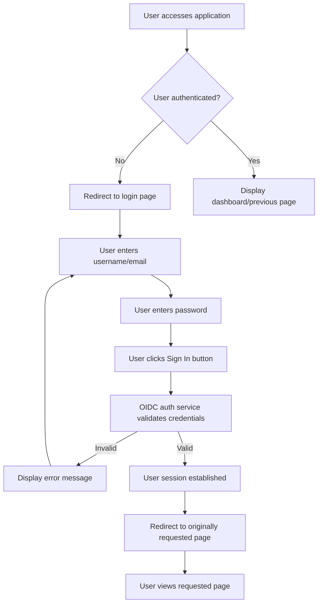

# Login Feature Specification

## Introduction

### Feature Overview

The Login feature enables users to authenticate through an OIDC (OpenID Connect) flow without requiring application-level signup or backend login API implementation. Authentication is delegated to external identity providers: Keycloak for local development and AWS Cognito for production.

### Business Value

- Provides secure access to the application without storing user credentials locally
- Reduces application complexity by outsourcing authentication to trusted identity providers
- Enables seamless integration with existing identity management systems
- Improves user experience through standard OIDC authentication flows
- Minimizes security risks by avoiding credential management in the application

### Dependencies

- External authentication service: Keycloak (local development) or AWS Cognito (production)
- OIDC protocol support on both client and auth service

---

## User Stories

- As an unauthenticated user, I want to be automatically redirected to the login page when accessing the application
- As a user, I want to sign in using credentials managed by the auth service so that I can access the application
- As a user, I want to be redirected to my originally requested page after successful login so that I can continue my intended activity

---

## Functionality

### Overview

The Login feature provides an OIDC-based authentication flow that automatically authenticates users and manages their session state.

### Inputs

- **Username or Email**: User's account identifier (string, required)
- **Password**: User's password (string, required, masked on input)

### Outputs

- **Success**: Authenticated session established, user redirected to originally requested page
- **Failure**: User-friendly error message displayed, user remains on login page

### Behavior Details

- Unauthenticated users are automatically redirected to the login page
- Users must enter both username/email and password to proceed
- Form validation occurs on submit
- Credentials are submitted to the OIDC auth service for validation (not to the backend API)
- App uses the auth service session state to determine authentication status
- After successful authentication, users are redirected to their originally requested destination

### Edge Cases and Error Handling

- **Invalid credentials**: Display generic error ("Invalid username/email or password") to prevent account enumeration
- **Expired session**: Prompt user to re-authenticate if their session expires
- **Case sensitivity**: Username/email matching is handled by the auth service; password is case-sensitive

---

## Business Workflows

### Workflow: User Authentication and Redirect

---

## Use Cases

### Use Case 1: Auto-Redirect to Login

**Preconditions**: User is not authenticated

**Trigger**: User accesses the application URL

**Steps**:

1. User navigates to application URL
2. Application checks authentication status with the auth service
3. Application detects user is not authenticated
4. Application stores the requested page URL
5. Application redirects user to login page

**Postconditions**: User is on the login page; intended page URL is stored for redirect after login

---

### Use Case 2: Submit Login Credentials

**Preconditions**: User is on the login page; valid username/email and password exist in the auth service

**Trigger**: User clicks the Sign In button or presses Enter in the password field

**Steps**:

1. User enters username or email in the username field
2. User enters password in the password field
3. User clicks the "Sign In" button (or presses Enter)
4. Application validates that both fields are filled
5. Credentials are submitted to the OIDC auth service
6. Application receives authenticated session response from auth service
7. Application establishes an authenticated session

**Postconditions**: User session is established; user is redirected to originally requested page

---

### Use Case 3: Handle Invalid Credentials

**Preconditions**: User is on the login page; incorrect credentials are submitted

**Trigger**: User submits login form with incorrect credentials

**Steps**:

1. User enters incorrect username/email or password
2. User clicks the "Sign In" button
3. Application validates input fields are filled
4. Credentials are submitted to the OIDC auth service
5. Auth service rejects credentials
6. Application displays error message: "Invalid username/email or password"
7. Password field is cleared
8. User remains on login page

**Postconditions**: User can retry login; error message is visible until form is resubmitted

---

## Technical Requirements

### APIs and Integrations

- **Authentication**: Keycloak (local development) or AWS Cognito (production) via OIDC protocol
- **No backend login API**: Login API is not implemented in the backend; all authentication is handled by the auth service
- **Session validation**: Backend validates session tokens issued by the auth service for API requests

### Data Models and Storage

- No user profile data stored in system database
- User credentials managed entirely by the auth service
- No password hashing or credential management in the application

### Infrastructure Details

- Authentication service (Keycloak or Cognito) must be available and responsive
- Application requires environment variables for auth service configuration (client ID, auth endpoint, redirect URI)
- CORS configuration must allow login page requests to auth service

---

## Acceptance Criteria

- ✅ Unauthenticated users are automatically redirected to the login page
- ✅ No signup flow exists in the application
- ✅ Backend does not implement login API; authentication is entirely handled by the OIDC auth service
- ✅ Users can enter username/email and password in the login form
- ✅ Login form validates that both fields are filled before submission
- ✅ Valid credentials result in successful authentication through the OIDC auth service
- ✅ Successfully authenticated users are redirected to their originally requested page
- ✅ Invalid credentials display a generic error message without revealing account existence
- ✅ Form submission can be triggered by clicking Sign In button or pressing Enter in the password field
- ✅ Login page is responsive and works on mobile devices
- ✅ No user data or credentials are stored in the system database
