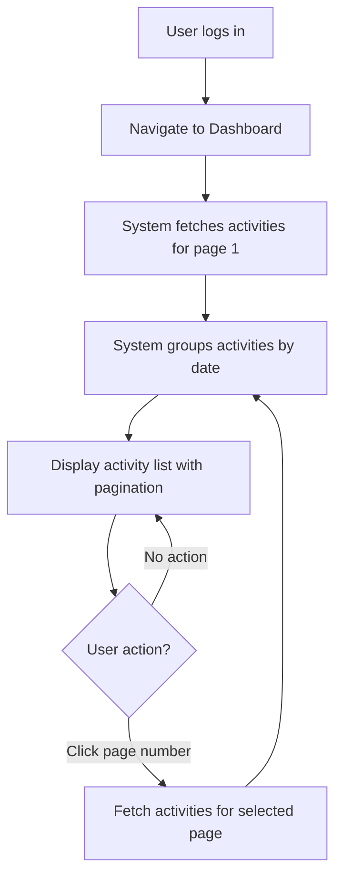

# View Activity List

## Introduction

**Description:**
The View Activity List feature allows users to see a paginated list of their activities (transactions) organized by date after logging into the dashboard. Activities include income and expense transactions with detailed information.

**Business Value:**
Enables users to quickly review their financial activities, understand spending/income patterns, and manage individual transactions through a user-friendly interface.

**Dependencies:**

- Authentication system (user must be logged in)
- Activity data model in database
- API endpoint to retrieve activities with pagination

---

## User Stories

- As a user, I want to view all my activities after login so that I can track my financial transactions.
- As a user, I want activities sorted by date (newest first) so that I can see recent transactions first.
- As a user, I want to see income and expense amounts with color differentiation so that I can quickly identify the transaction type.
- As a user, I want to see associated tags with each activity so that I can categorize and organize my transactions.
- As a user, I want to paginate through activities so that I can browse large amounts of transaction history.

---

## Functionality

### Overview

The feature displays a paginated list of user activities with the following components:

1. **Activity List** - primary content area displaying activity items
2. **Date Grouping** - activities grouped by date
3. **Activity Items** - individual transaction details
4. **Pagination Controls** - navigation through multiple pages

### Detailed Behavior

**Activity Display:**

- Each activity item displays:
  - Time with icon (e.g., `⏱ 10:42 am`)
  - Description/content (e.g., `mua gói tưa dâu dành cho ghế 89k`)
  - Amount (e.g., `89`)
  - Associated tags on the right (e.g., `#nec`, `#household`)

**Date Grouping:**

- Activities are grouped by date (e.g., `Mon, 27 Apr, 2026`)
- Date headers appear above each group of activities from that day
- Groups are ordered by date, newest first
- Items in each group are ordered by time, newest first

**Pagination:**

- Default page size: **5 items per page**
- Pagination controls include:
  - Previous button (`<`) - navigates to previous page (disabled on first page)
  - First page button (`1`) - always visible
  - Current page indicator (e.g., `4`) - shown with gray background
  - Last page button (e.g., `20`) - shows total page count
  - Ellipsis (`...`) - indicates skipped pages
  - Next button (`>`) - navigates to next page (disabled on last page)

**Outputs:**

- Rendered activity list with date grouping
- Functional pagination controls

### Edge Cases and Error Handling

- **Empty list:** Display message "There's no items to display." if user has no transactions
- **Network error:** Display "Please check your network connection." message with "Try Again" button
- **Invalid page number:** Redirect to first page

---

## Business Workflows

### Workflow: View Activity List



---

## Use Cases

### Use Case 1: View Activity List on Dashboard

**Preconditions:**

- User is logged in
- User has navigated to dashboard

**Trigger:**

- Page loads or user navigates to dashboard

**Steps:**

1. System fetches activities for page 1 (default)
2. System organizes activities by date (newest first)
3. System renders date headers for each unique date
4. System renders activity items under corresponding date
5. System displays pagination controls

**Postconditions:**

- User sees first page of activities organized by date
- Pagination controls are visible and functional

### Use Case 2: Navigate Between Pages

**Preconditions:**

- Activity list is displayed
- Multiple pages of activities exist

**Trigger:**

- User clicks pagination button (page number, next, previous, or first/last)

**Steps:**

1. User clicks pagination control
2. System validates page number
3. System fetches activities for requested page
4. System reorganizes activities by date
5. System updates current page indicator
6. System updates pagination controls availability

**Postconditions:**

- User sees activities for selected page
- Page indicator shows current page
- Pagination buttons update appropriately (previous/next disabled as needed)

---

## UI/UX Requirements

### Screen Layout

**Activity List Layout:**

The layout displays activities grouped by date with the following structure for each item:

```
Thu, 23 Apr, 2026
  ⏱ 10:42 am                                   ⋮
  mua gói tưa dâu dành cho ghế 89k
  89                                        #nec

  ⏱ 8:00 am                                    ⋮
  ăn sáng bún riêu 45k
  45                                     #household

Wed, 22 Apr, 2026
  ⏱ 11:13 pm                                   ⋮
  đặt cọc mua xe máy vinfast viper 1000k
  1,000                                     #nec

  ⏱ 5:30 pm                                    ⋮
  mua bánh tại chong chóng bakery cho mẹ 20k
  20                                        #give

Pagination: < 1 ... 4 5 6 ... 20 >
```

### Interaction Details

**Pagination Interactions:**

- Clicking page number loads that page
- Previous (`<`) button disabled on page 1
- Next (`>`) button disabled on last page
- First page button (`1`) always clickable
- Last page button shows total page count
- Ellipsis (`...`) indicates skipped pages (non-clickable)
- Current page shows with distinct styling (gray background)
- Page transitions include loading state

### Consistency Rules

- **Design System Alignment:**
  - Follow existing component library for buttons, dropdowns, dialogs
  - Use consistent spacing and padding
  - Font sizes: heading (20px), body (14px), secondary (12px)
  - Use brand color palette for highlights and accents

- **Visual Consistency:**
  - Date header style consistent across all groups
  - Activity item layout consistent for all items
  - Pagination controls match other list pagination in application

### Error Messages

- **Empty List:** "There's no items to display."
- **Network Error:** "Please check your network connection." (with "Try Again" button)

---

## Acceptance Criteria

1. ✅ Activities display in a paginated list on the dashboard after user login
2. ✅ Activities are sorted by datetime, newest first
3. ✅ Activities are grouped by date with date headers (e.g., "Thu, 23 Apr, 2026")
4. ✅ Each activity displays: time (with icon), description, amount, and tags
5. ✅ Default page size is **5 items per page**
6. ✅ Pagination controls display: `< 1 ... 4 5 6 ... 20 >`
7. ✅ Clicking pagination button loads corresponding page
8. ✅ Empty state displays "There's no items to display." message
9. ✅ Network error displays "Please check your network connection." with "Try Again" button

---

## Out of Scope

- Update activity functionality
- Delete activity functionality
- Action menu (three-dot menu)
- These features are documented separately.
