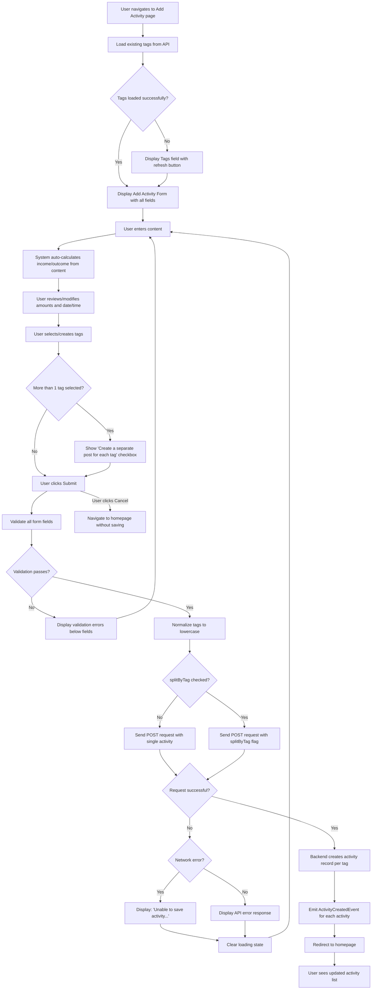

# Use Case: Add Activity

## Overview

Users create and log financial activities by adding descriptions, tags, dates, and optional amounts.

The feature simplifies entry with auto-calculation and validation feedback for accuracy.

## Actors

- **Primary Actor:** Logged-in user who wants to record a new financial activity.
- **Secondary Actors:**
  - Web application (displays form and processes input)
  - Backend system (validates data, creates activity records, and retrieves existing tags)

## Preconditions

- The user has a registered account
- The user is authenticated and logged in
- The user has navigated to the Add Activity page (`/activities/new`)
- Existing tags are available in the system (may be empty)

## Main Flow

1. The system loads the Add Activity page
2. The system fetches existing tags from the API
3. The system displays the Activity Form with the following fields (in order):
   - Content field with autofocus enabled
   - Income field (optional, initially empty)
   - Outcome field (optional, initially empty)
   - Time field (defaulting to current date/time)
   - Tags field with autocomplete (showing existing tags)
   - Cancel and Submit buttons
4. The user enters a description in the Content field
5. The system automatically analyzes the content and calculates income/outcome based on the auto-calculation logic (see [Income/Outcome Auto-Calculation Logic](./auto-calc-amounts.md))
6. If amounts are detected, the system populates the Income and/or Outcome fields with the calculated values
7. The user optionally reviews and modifies the auto-calculated Income and/or Outcome values
8. The user confirms or modifies the date/time in the Time field
9. The user selects one or more tags from the Tags field (or creates new custom tags)
10. If the user selects more than one tag, the system displays a "Create a separate post for each tag" checkbox (unchecked by default) below the Tags field
11. The user clicks the Submit button
12. The system validates all form fields:
    - Content: required, non-empty string
    - Tags: required, array of strings
    - Time: required, valid date
    - Income: optional, valid number if provided
    - Outcome: optional, valid number if provided
13. All validation passes
14. The system normalizes tags (converts to lowercase and trims whitespace)
15. The system sends a POST request to `/api/diary/activities` with the form data
16. The backend creates the activity record(s) in the database
17. The system emits an ActivityCreatedEvent for each created activity
18. The system redirects the user to the homepage
19. The user sees the updated activity list with the newly created activity(s)

## Alternate Flows

### Alternate Flow 1: Form Validation Failure

1. From the Main Flow, after step 11 (user clicks Submit)
2. The system validates all form fields
3. One or more validation errors are detected (e.g., Content is empty, Tags is empty, invalid Time)
4. The system displays error messages below the corresponding fields:
   - "This field is required" for empty required fields
   - "This field is required" for invalid dates
5. The form is not submitted
6. The user reviews the error messages
7. The user corrects the invalid fields
8. The use case continues from Main Flow, step 11 (user clicks Submit again)

### Alternate Flow 2: Network or API Error

1. From the Main Flow, after step 15 (system sends POST request)
2. A network error or server error occurs during submission
3. The system displays an error message:
   - If network issue: "Unable to save activity. Please check your connection and try again."
   - If server validation error: Display the validation error from the API response
   - If server error: "An error occurred while saving the activity. Please try again."
4. The Submit button's loading state is cleared
5. The user remains on the Add Activity form
6. The user can modify the form data and resubmit
7. The use case continues from Main Flow, step 11 (user retries submission)

### Alternate Flow 3: Tag Fetch Failure

1. From the Main Flow, after step 2 (system fetches existing tags)
2. A network or API error occurs while fetching tags
3. The system displays the Tags field with a loading error state and a refresh button
4. The user can click the refresh button to retry fetching tags
5. If the retry succeeds, the system displays available tags
6. If the retry fails again, the user can still proceed with custom tags
7. The use case continues from Main Flow, step 4

### Alternate Flow 4: User Manually Overrides Auto-calculated Values

1. From the Main Flow, after step 6 (system auto-calculates amounts)
2. The user reviews the calculated Income and/or Outcome values
3. The user manually edits one or both financial amount fields
4. For details on how manual overrides interact with auto-calculation, see [Income/Outcome Auto-Calculation Logic](./auto-calc-amounts.md)
5. The user continues from Main Flow, step 10 (user clicks Submit)

### Alternate Flow 5: User Creates New Custom Tags

1. From the Main Flow, after step 9 (user selects tags)
2. The user types a custom tag name that doesn't exist in the autocomplete list
3. The system allows free solo mode, enabling creation of new tags
4. The system creates a new tag option for the user-entered text
5. The user selects the newly created tag
6. The tag is added to the form
7. When submitted, this custom tag is created in the system along with the activity
8. The use case continues from Main Flow, step 10

### Alternate Flow 6: User Cancels Activity Entry

1. From the Main Flow, after step 3 (Add Activity form is displayed)
2. The user has entered some data in one or more form fields
3. The user clicks the Cancel button
4. The system navigates back to the homepage
5. All form data is discarded (no activity is created)
6. The use case ends

### Alternate Flow 7: Auto-calculation with Multiple Financial Lines

Refer to [Income/Outcome Auto-Calculation Logic](./auto-calc-amounts.md) for examples of how the system handles multi-line content with multiple transactions. The use case continues from Main Flow, step 9 with the calculated values populated.

### Alternate Flow 8: Create a Separate Activity per Tag

1. From the Main Flow, after step 10 (checkbox is visible and user checks it)
2. The user checks the "Create a separate post for each tag" checkbox
3. The user clicks the Submit button (Main Flow, step 11)
4. All validation passes (Main Flow, steps 12–14)
5. The system sends a POST request to `/api/diary/activities` with the `splitByTag` flag set to `true`
6. The backend iterates over each normalized tag and creates one activity record per tag, each with:
   - The same content, income, outcome, and time as submitted
   - Only the single corresponding tag
7. For each successfully created activity, the backend emits an ActivityCreatedEvent
8. If any individual activity creation fails, the backend continues creating the remaining activities and reports partial failures in the response
9. The system redirects the user to the homepage
10. The user sees the updated activity list showing all newly created activities

## Flowchart

## Postconditions

- A new activity record (or multiple records) is created in the database with the user-provided information
- Each activity includes:
  - Content/description
  - Associated tag(s) (normalized to lowercase)
  - Date and time
  - Optional income amount (if provided or auto-calculated)
  - Optional outcome/expense amount (if provided or auto-calculated)
- When "Create a separate post for each tag" is checked, one activity is created per tag; each activity carries only its own single tag
- The user is redirected to the homepage
- The newly created activity(s) appear in the activity list on the homepage
- If cancelled, no activity is created and the user returns to the homepage

## Success Criteria

- The user can successfully create a new activity with all required information
- The Content, Tags, and Time fields are required; Income and Outcome are optional
- The form displays fields in the order: Content → Income → Outcome → Time → Tags → Checkbox
- The "Create a separate post for each tag" checkbox is only visible when more than one tag is selected, and is hidden otherwise
- The checkbox is unchecked by default and does not appear on the Edit Activity form
- When the checkbox is checked, the backend creates one activity per tag, each with only that single tag
- If some individual activity creations fail during a split submission, the backend continues creating the rest and reports partial failures
- Auto-calculation of financial amounts from the description works accurately (see [Income/Outcome Auto-Calculation Logic](./auto-calc-amounts.md))
- Users can manually override calculated values with behavior described in [Income/Outcome Auto-Calculation Logic](./auto-calc-amounts.md)
- Form validation provides clear error messages for invalid or missing data
- Users can create custom tags not in the existing tag list
- The form submission handles network and server errors gracefully with appropriate messaging
- After successful submission, the user is redirected to the homepage and sees the new activity(s)
- Users can cancel the activity creation at any time and return to the homepage
- All form fields are accessible via keyboard navigation and properly labeled for screen readers
- The Content field receives autofocus for improved user experience
