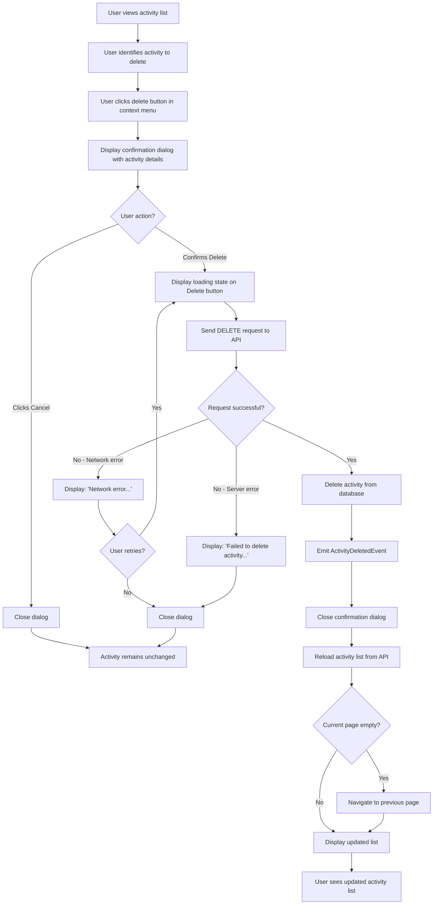

# Use Case: Delete Activity

## Overview

Users can remove financial activity records permanently. The workflow includes confirmation prompts, error handling, and list updates, with safety ensured by requiring user confirmation.

## Actors

- **Primary Actor:** Logged-in user who wants to remove a financial activity record.
- **Secondary Actors:**
  - Web application (displays delete controls and manages dialog)
  - Backend system (processes deletion request and manages data persistence)

## Preconditions

- The user has a registered account
- The user is authenticated and logged in
- The user is viewing the activity list on the homepage
- The activity exists in the database
- The user has access to delete the activity

## Main Flow

1. The user views the activity list on the homepage
2. The user identifies an activity they want to delete
3. The user clicks the delete button (trash icon) in the activity item's context menu
4. The system displays a confirmation dialog with:
   - Title: "Delete Activity?"
   - Message: Activity details (date/time) for verification
   - Warning: "This action cannot be undone."
   - Two action buttons: "Delete" (red/danger color) and "Cancel" (neutral color)
5. The user reviews the activity details in the confirmation dialog
6. The user clicks the "Delete" button to confirm the deletion
7. The system displays a loading state on the Delete button
8. The system sends a DELETE request to `/api/diary/activities/{id}` with the activity ID
9. The backend successfully processes the deletion request
10. The backend removes the activity record from the database
11. The backend emits an ActivityDeletedEvent
12. The system receives a successful response (200 or 204) from the API
13. The system closes the confirmation dialog
14. The system reloads the activity list from the API
15. The system displays the updated activity list without the deleted activity
16. The user sees the activity list with the deleted activity removed

## Alternate Flows

### Alternate Flow 1: User Cancels Deletion

1. From the Main Flow, after step 4 (confirmation dialog is displayed)
2. The user reviews the activity details in the confirmation dialog
3. The user decides not to delete and clicks the "Cancel" button
4. The system closes the confirmation dialog without sending any API request
5. The activity remains unchanged in the database
6. The user remains on the activity list view
7. The use case ends

### Alternate Flow 2: Server Error (500 Error)

1. From the Main Flow, after step 8 (system sends DELETE request)
2. The backend returns a 500 Internal Server Error response
3. A database or server error occurs during deletion
4. The system closes the loading state on the Delete button
5. The system displays an error message: "Failed to delete activity. Please try again later."
6. The system closes the confirmation dialog
7. The user remains on the activity list
8. The use case ends

### Alternate Flow 3: Network Error

1. From the Main Flow, after step 8 (system sends DELETE request)
2. A network error or timeout occurs before receiving a response from the API
3. The system closes the loading state on the Delete button
4. The system displays an error message: "Network error. Failed to delete activity. Please check your connection and try again."
5. The confirmation dialog remains open, allowing the user to retry
6. The user can click the "Delete" button again to retry the deletion
7. If retry succeeds, the use case continues from Main Flow, step 9
8. If retry fails, the error message is displayed again

### Alternate Flow 4: Current Page Becomes Empty After Deletion

1. From the Main Flow, after step 14 (activity list is reloaded)
2. The deleted activity was the only item on the current page
3. The current page now has no activities
4. The system detects that the current page is empty
5. The system navigates the user to the previous page
6. The system displays the previous page with remaining activities
7. The use case ends

### Alternate Flow 5: User Retries After Error

1. From an error alternate flow (2 or 3)
2. The confirmation dialog is still visible with the error message
3. The user modifies their choice or clicks "Delete" again to retry
4. The system clears the error message
5. The system displays loading state on the Delete button
6. The system resends the DELETE request
7. The use case continues from Main Flow, step 9 (if successful) or displays new error

## Flowchart

## Postconditions

- The activity record is permanently removed from the database
- An ActivityDeletedEvent is emitted for system-wide notification
- The activity list is reloaded and refreshed
- The deleted activity is no longer visible in the list
- If the current page became empty, the user is navigated to the previous page
- If the deletion was cancelled or encountered an error, the activity remains unchanged in the database

## Success Criteria

- The user can successfully delete an activity from the activity list
- A confirmation dialog is displayed with activity details before deletion occurs
- The confirmation dialog can be closed via Cancel button, Escape key, or clicking outside
- Cancelling the deletion does not modify the activity in the database
- The deletion API request is sent with correct authentication
- Successful deletion results in the activity being removed from the database
- The activity list is automatically reloaded to reflect the deletion
- Deleted activity is no longer visible in the activity list
- Network and server errors are handled gracefully with appropriate error messages
- Users can retry failed deletion attempts
- If the current page becomes empty after deletion, the user is navigated to the previous page
- The Delete button displays a loading state during the API request
- All dialogs and controls are accessible via keyboard navigation
- Error messages are clear and user-friendly
