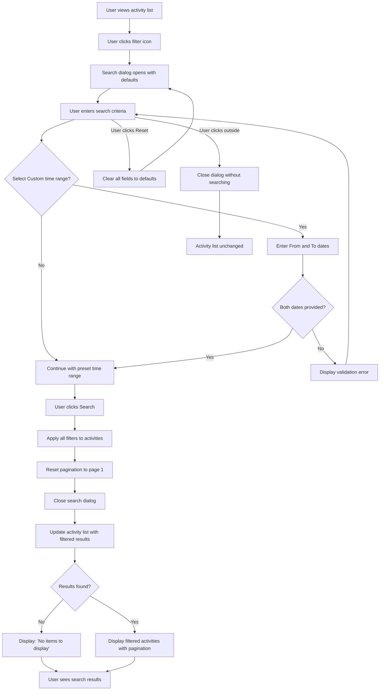

# Use Case: Search Activity

## Overview

Users can search and filter transactions using text, tags, and dates. The feature supports preset ranges, custom dates, and multiple criteria for flexible, efficient browsing.

## Actors

- **Primary Actor:** Logged-in user who wants to find specific activities.
- **Secondary Actors:**
  - Web application (displays search dialog and processes filters)
  - Backend system (executes search queries and retrieves filtered activities)

## Preconditions

- The user has a registered account
- The user is authenticated and logged in
- The user is viewing the activity list on the homepage
- Activities exist in the database for the user
- Tags are available in the system (for tag filtering)

## Main Flow

1. The user views the activity list on the homepage
2. The user clicks the filter icon button in the toolbar
3. The system opens the Search Activities dialog with default values:
   - Text field: empty
   - Tags field: empty
   - Time Range: "This Month"
   - Custom date fields: hidden (if Custom is not selected)
4. The user enters search criteria in one or more fields:
   - Optionally enters text in the Text field
   - Optionally selects one or more tags in the Tags field
   - Optionally selects a time range (or leaves it as "This Month")
5. If the user selects "Custom" as the time range, two date picker fields appear:
   - The user selects a "From" date (start of day 00:00:00)
   - The user selects a "To" date (end of day 23:59:59)
6. The user reviews all entered search criteria
7. The user clicks the "Search" button
8. The system validates the search criteria:
   - If "Custom" time range is selected, both From and To dates must be provided
9. The system applies all filters to the activity list:
   - Text search: finds activities containing the entered text (case-insensitive)
   - Tag filter: includes activities matching ANY of the selected tags (OR logic)
   - Time range filter: includes activities within the selected date range
10. The system combines all criteria with AND logic (text AND tags AND time range)
11. The system resets pagination to page 1
12. The dialog closes
13. The activity list updates to display the filtered results
14. The user sees activities matching all applied search criteria, organized by date with pagination controls

## Alternate Flows

### Alternate Flow 1: Preset Time Range Filtering

1. From the Main Flow, after step 4 (user enters search criteria)
2. The user clicks on the Time Range dropdown
3. The system displays preset options: All, This Week, This Month, This Year, Last Month, Custom
4. The user selects a preset option (e.g., "This Week")
5. The custom date fields remain hidden
6. The use case continues from Main Flow, step 7 (user clicks Search)
7. The activity list displays only activities from the selected time period

### Alternate Flow 2: Custom Date Range Filtering

1. From the Main Flow, after step 4 (user enters search criteria)
2. The user clicks on the Time Range dropdown
3. The system displays preset options
4. The user selects "Custom"
5. Two date picker fields appear: "From" and "To"
6. The user selects the "From" date (e.g., April 1, 2026)
7. The system sets the From time to start of day (00:00:00)
8. The user selects the "To" date (e.g., April 30, 2026)
9. The system sets the To time to end of day (23:59:59)
10. The use case continues from Main Flow, step 7 (user clicks Search)
11. The activity list displays only activities within the specified custom date range

### Alternate Flow 3: Combined Multi-Criteria Search

1. From the Main Flow, after step 4 (user enters search criteria)
2. The user enters text in the Text field (e.g., "restaurant")
3. The user selects multiple tags in the Tags field (e.g., "food", "dining")
4. The user selects a time range from the dropdown (e.g., "This Month")
5. The use case continues from Main Flow, step 7 (user clicks Search)
6. The system applies all filters:
   - Text containing "restaurant" AND
   - Tags matching "food" OR "dining" AND
   - Activities within this month
7. The activity list displays only activities matching all criteria

### Alternate Flow 4: Reset Search Filters

1. From the Main Flow, after step 4 (user enters search criteria)
2. The user has entered values in one or more search fields
3. The user clicks the "Reset" button
4. The system clears all fields to default values:
   - Text: empty string
   - Tags: empty array
   - Time Range: "This Month"
   - Custom date fields: hidden and cleared
5. The dialog remains open
6. The search is NOT executed
7. The user can enter new search criteria or close the dialog

### Alternate Flow 5: No Search Results

1. From the Main Flow, after step 12 (dialog closes and activity list updates)
2. No activities match the applied search criteria
3. The activity list displays the empty state message: "There's no items to display."
4. Pagination controls are hidden or disabled
5. The user can modify the search criteria or return to view all activities
6. The use case ends

## Flowchart

## Postconditions

- The activity list displays activities matching all applied search criteria:
  - Activities containing the searched text (if text was provided)
  - Activities with at least one of the selected tags (if tags were selected)
  - Activities within the selected date range (if a time range was selected)
- If no activities match the criteria, an empty state message is displayed
- If the dialog was closed without searching or cancelled, the activity list remains unchanged showing previous results

## Success Criteria

- The user can successfully open the search dialog by clicking the filter icon
- The search dialog displays all necessary fields with proper default values
- The user can enter text search criteria and see activities containing that text
- The user can select one or more tags and see activities with those tags (OR logic)
- The user can select a preset time range and see activities from that period
- The user can select a custom date range and see activities within that range
- The user can combine multiple search criteria and see activities matching all criteria (AND logic)
- The Reset button clears all search fields to defaults without executing a search
- Incomplete custom date ranges are caught with validation messages
- Search results update immediately when the Search button is clicked
- Pagination resets to page 1 after applying search filters
- If no activities match the search criteria, an appropriate empty state message is displayed
- The search dialog can be closed via Cancel button, Escape key, or clicking outside
- All form fields are accessible via keyboard navigation
- The Text field receives autofocus when the dialog opens
- The feature handles special characters in text search appropriately
- Multiple tag selection uses OR logic (activities with ANY selected tag)
- Date range filtering is applied with From at start of day and To at end of day
