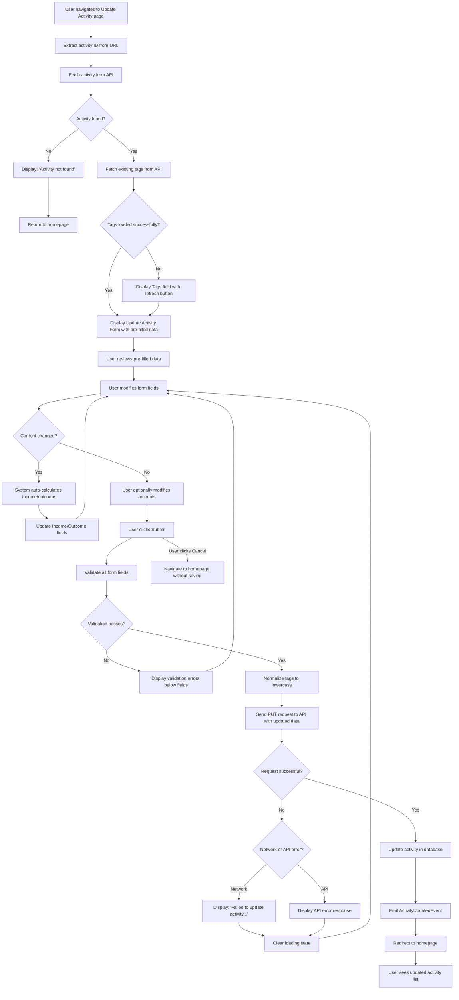

# Use Case: Update Activity

## Overview

Users update existing financial activities by modifying descriptions, tags, dates, and amounts. The feature ensures accuracy with pre-filled forms, smart recalculation, and clear validation.

## Actors

- **Primary Actor:** Logged-in user who wants to modify an existing financial activity.
- **Secondary Actors:**
  - Web application (displays form and processes input)
  - Backend system (fetches activity, validates updates, and persists changes)

## Preconditions

- The user has a registered account
- The user is authenticated and logged in
- The activity exists in the database
- The user has navigated to the Update Activity page (`/activities/:id`)
- The activity ID is valid and corresponds to an existing activity

## Main Flow

1. The system extracts the activity ID from the URL parameter
2. The system fetches the activity data from `/api/diary/activities/{id}`
3. The system fetches existing tags from the API
4. The system displays the Update Activity page with the title "Update Activity"
5. The system pre-fills the Activity Form with the existing activity data:
   - Content field contains the existing activity description (with autofocus)
   - Tags field is populated with the activity's existing tags
   - Time field shows the activity's current date/time
   - Income field shows the existing income amount (if any)
   - Outcome field shows the existing outcome amount (if any)
   - Cancel and Submit buttons are displayed
6. The user reviews the pre-filled data
7. The user modifies one or more form fields:
   - Changes the content description, and/or
   - Updates the tags, and/or
   - Modifies the date/time, and/or
   - Adjusts income/outcome amounts
8. If the user modifies the Content field, the system automatically recalculates income/outcome based on the auto-calculation logic (see [Income/Outcome Auto-Calculation Logic](./auto-calc-amounts.md))
9. The user can manually override the calculated income/outcome values, with behavior described in [Income/Outcome Auto-Calculation Logic](./auto-calc-amounts.md)
10. The user clicks the Submit button
11. The system validates all form fields:
    - Content: required, non-empty string
    - Tags: required, array of strings
    - Time: required, valid date
    - Income: optional, valid number if provided
    - Outcome: optional, valid number if provided
12. All validation passes
13. The system normalizes tags (converts to lowercase and trims whitespace)
14. The system sends a PUT request to `/api/diary/activities/{id}` with the updated form data
15. The backend updates the activity record in the database
16. The backend emits an ActivityUpdatedEvent with before and after activity data
17. The system redirects the user to the homepage
18. The user sees the updated activity list with the modified activity showing new data

## Alternate Flows

### Alternate Flow 1: Activity Not Found

1. From the Main Flow, after step 2 (system fetches activity data)
2. The activity does not exist in the database (invalid ID or activity was deleted)
3. The system displays an error message: "Activity not found"
4. The system provides a link or button to return to the homepage
5. The user clicks the link to return to the homepage
6. The use case ends

### Alternate Flow 2: Activity Fetch Error

1. From the Main Flow, after step 2 (system fetches activity data)
2. A network or server error occurs during the fetch request
3. The system displays a loading error message
4. The system displays a "Try Again" button
5. The user can click "Try Again" to retry fetching the activity
6. If the retry succeeds, the use case continues from Main Flow, step 3
7. If the retry fails, the error message remains and user can return to homepage

### Alternate Flow 3: Form Validation Failure

1. From the Main Flow, after step 10 (user clicks Submit)
2. The system validates all form fields
3. One or more validation errors are detected (e.g., Content is empty, Tags is empty, invalid Time)
4. The system displays error messages below the corresponding fields:
   - "This field is required" for empty required fields
   - "Invalid date" for invalid dates
5. The form is not submitted
6. The user reviews the error messages
7. The user corrects the invalid fields
8. The use case continues from Main Flow, step 10 (user clicks Submit again)

### Alternate Flow 4: Network or API Error During Update

1. From the Main Flow, after step 14 (system sends PUT request)
2. A network error or server error occurs during the update
3. The system displays an error message:
   - If network issue: "Failed to update activity. Please check your connection and try again."
   - If server validation error: Display the validation error from the API response
   - If server error: "Failed to update activity. Please try again."
4. The Submit button's loading state is cleared
5. The user remains on the Update Activity form
6. The form data is preserved, allowing the user to modify and resubmit
7. The use case continues from Main Flow, step 7 (user can make further changes and retry)

### Alternate Flow 5: Tag Fetch Failure

1. From the Main Flow, after step 3 (system fetches existing tags)
2. A network or API error occurs while fetching tags
3. The system displays the Tags field with a loading error state and a refresh button
4. The user can click the refresh button to retry fetching tags
5. If the retry succeeds, the system displays available tags
6. If the retry fails again, the user can still proceed with custom tags or existing selections
7. The use case continues from Main Flow, step 5

### Alternate Flow 6: User Manually Overrides Calculated Values

1. From the Main Flow, after step 8 (system auto-calculates amounts following content change)
2. The user reviews the calculated Income and/or Outcome values
3. The user manually edits one or both financial amount fields
4. For details on how manual overrides interact with auto-calculation, see [Income/Outcome Auto-Calculation Logic](./auto-calc-amounts.md)
5. The user continues from Main Flow, step 10 (user clicks Submit)

### Alternate Flow 7: User Modifies Tags

1. From the Main Flow, after step 7 (user modifies form fields)
2. The user clicks on the Tags field
3. The system displays the autocomplete dropdown with existing tags
4. The user can:
   - Select new tags from the existing list
   - Deselect existing tags
   - Type a custom tag name not in the list
5. For custom tags, the system allows free solo mode
6. The user completes tag selection
7. The use case continues from Main Flow, step 9

### Alternate Flow 8: User Cancels Editing

1. From the Main Flow, after step 5 (Update Activity form is displayed)
2. The user has made changes to one or more form fields
3. The user clicks the Cancel button
4. The system navigates back to the homepage without confirmation
5. All unsaved changes are discarded
6. The activity in the database remains unchanged
7. The use case ends

### Alternate Flow 9: Auto-calculation with Modified Multi-line Content

Refer to [Income/Outcome Auto-Calculation Logic](./auto-calc-amounts.md) for examples of how the system handles multi-line content with multiple transactions. The use case continues from Main Flow, step 9 with recalculated values.

## Flowchart

## Postconditions

- The activity record in the database is updated with the new information, including:
  - Updated content/description
  - Updated tags (normalized to lowercase)
  - Updated date and time
  - Updated optional income amount (if provided or auto-calculated)
  - Updated optional outcome/expense amount (if provided or auto-calculated)
- The ActivityUpdatedEvent is emitted with before and after activity data
- The user is redirected to the homepage
- The updated activity appears in the activity list with the new data
- If cancelled, the activity remains unchanged in the database and the user returns to the homepage

## Success Criteria

- The user can successfully load the Update Activity page with pre-filled existing activity data
- All form fields are correctly populated with the current activity information
- When the user modifies the Content field, income/outcome values are automatically recalculated (see [Income/Outcome Auto-Calculation Logic](./auto-calc-amounts.md))
- Users can manually override calculated values with behavior described in [Income/Outcome Auto-Calculation Logic](./auto-calc-amounts.md)
- Form validation provides clear error messages for invalid or missing data
- Users can modify tags, including adding custom tags not in the existing list
- The form submission handles network and server errors gracefully with appropriate messaging
- After successful submission, the user is redirected to the homepage and sees the updated activity
- Users can cancel the update at any time and return to the homepage without saving changes
- If the activity is not found or was deleted, an appropriate error message is displayed
- All form fields are accessible via keyboard navigation and properly labeled for screen readers
- The Content field receives autofocus for improved user experience when editing
