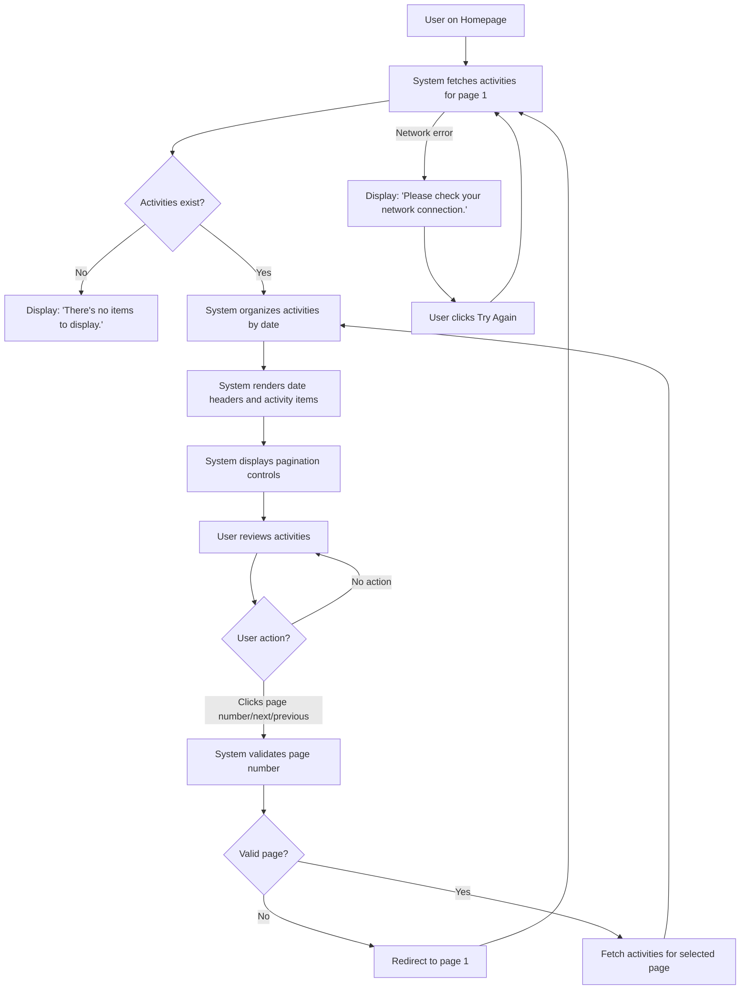

# Use Case: View Activity List

## Overview

Users can see their financial transactions organized by date on the homepage, explore history, understand spending/income, and move across pages.

## Actors

- **Primary Actor:** Logged-in user who wants to review their financial activities.
- **Secondary Actors:**
  - Web application (displays activities with pagination)
  - Backend system (fetches and organizes activity data)

## Preconditions

- The user has a registered account
- The user is authenticated and logged in
- The user has navigated to or is on the homepage
- Activity data exists in the database for the user

## Main Flow

1. The user navigates to or refreshes the homepage
2. The system fetches activities for page 1 (default)
3. The system organizes activities by date, with newest dates first
4. The system renders a date header for each unique date (e.g., "Thu, 23 Apr, 2026")
5. Under each date header, the system displays activity items with the following information:
   - Time with icon (e.g., "⏱ 10:42 am")
   - Description/content (e.g., "mua gói tưa dâu dành cho ghế 89k")
   - Amount with color differentiation:
     - Green for income transactions
     - Red for expense transactions
   - Associated tags (e.g., "#nec", "#household")
6. The system displays pagination controls at the bottom:
   - Previous button (`<`) - disabled on first page
   - First page button (`1`) - always visible
   - Current page indicator showing current page number with gray background
   - Additional page numbers with ellipsis (`...`) for skipped pages
   - Last page button showing total page count (e.g., `20`)
   - Next button (`>`) - disabled on last page
7. The user reviews their activities organized by date

## Alternate Flows

### Alternate Flow 1: User Navigates to a Different Page

1. From the Main Flow, after step 7
2. The user clicks on a pagination control (page number, next, or previous button)
3. The system validates the requested page number
4. If valid, the system fetches activities for the requested page
5. The system reorganizes activities by date (newest first)
6. The system updates the current page indicator
7. The system updates pagination controls availability (disabling previous on page 1, disabling next on last page)
8. The user sees activities for the selected page

**Alternate Flow 1a: Invalid Page Navigation**

- In step 3, if the page number is invalid
- The system redirects to the first page
- The use case continues from Main Flow, step 2

### Alternate Flow 2: Empty Activity List

1. From the Main Flow, after step 2
2. If the user has no activities
3. The system displays the message: "There's no items to display."
4. No date headers or activity items are displayed
5. Pagination controls are hidden or disabled
6. The use case ends

### Alternate Flow 3: Network Error

1. During the Main Flow or Alternate Flow 1, when fetching activities
2. A network error occurs
3. The system displays an error message: "Please check your network connection."
4. The system displays a "Try Again" button
5. The user can click "Try Again" to retry fetching activities
6. If the retry succeeds, the use case continues from Main Flow, step 3
7. If the retry fails, the error message remains displayed

### Alternate Flow 4: User Clicks First Page Button

1. From the Main Flow or any alternate flow, when the user is not on page 1
2. The user clicks the first page button (`1`)
3. The system fetches activities for page 1
4. The use case continues from Main Flow, step 3

## Flowchart

## Postconditions

- The user sees activities organized by date (newest first) on the current page
- Each activity item displays time, description, amount with appropriate color, and associated tags
- Pagination controls are visible and reflect the current page
- The user can navigate between pages or refresh the view
- Activity data remains consistent with the backend database

## Success Criteria

- The user can view a list of their activities on the homepage without errors
- Activities are clearly organized by date with readable date headers
- Activities are displayed with all required information (time, description, amount, tags)
- Income and expense transactions are visually distinguishable through color (green vs. red)
- Pagination controls are present and functional, allowing the user to navigate between pages
- For users with no activities, a clear "no items" message is displayed
- Network errors are handled gracefully with appropriate error messaging and retry options
- Page navigation is responsive and updates the view correctly
- The interface is user-friendly and intuitive for reviewing financial activities
